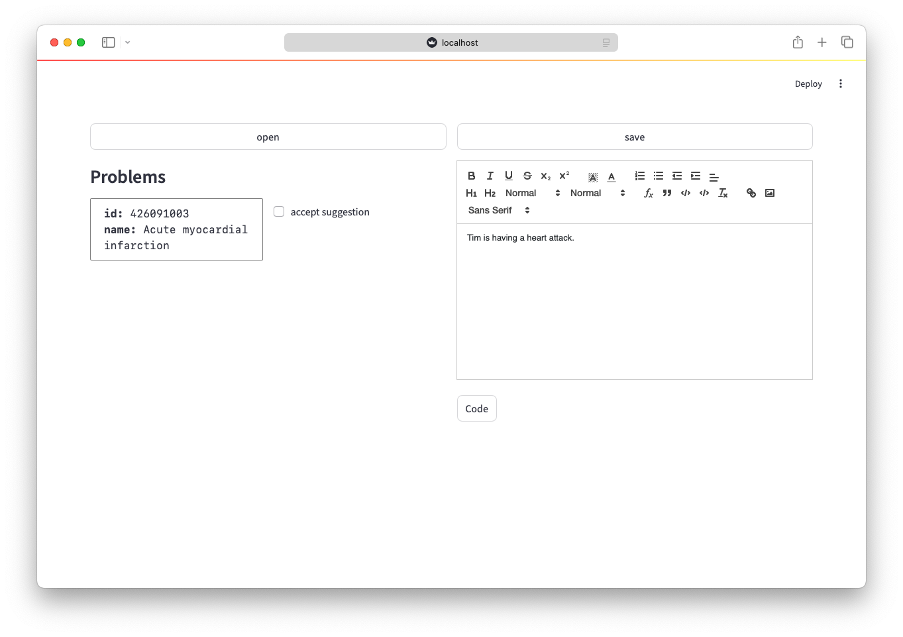

# Streamlit UI



> [!IMPORTANT]
> This currently depends on using a local Ollama hosted instance of mistral. Install [Ollama](https://ollama.com), then get mistral by running `ollama pull mistral`.

Build and install with [uv](https://github.com/astral-sh/uv) and npm:
```bash
uv venv
uv install .
npm install --prefix src/frontend
npm run --prefix src/frontend build
```

Run with:
```bash
uv run streamlit run src/main.py
```
The data directory, where it saves documents, defaults to `data` in your workign directory.

To run with a custom data directory:
```bash
uv run streamlit run src/main.py -- --dir <PATH/TO/CUSTOM/DIRECTORY>
```
